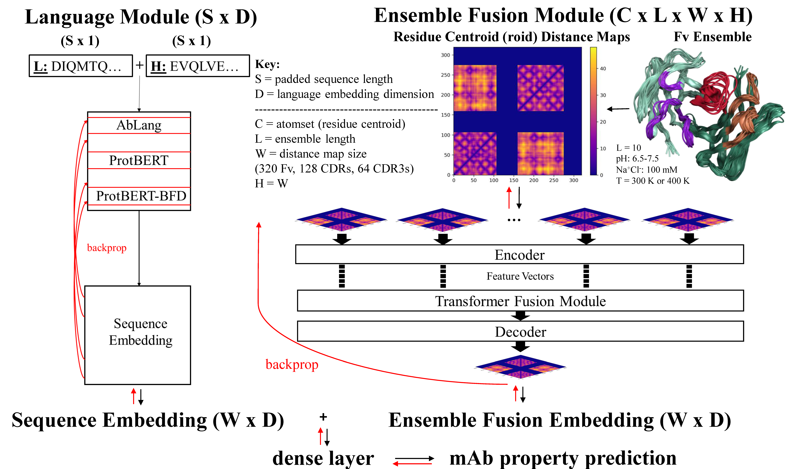
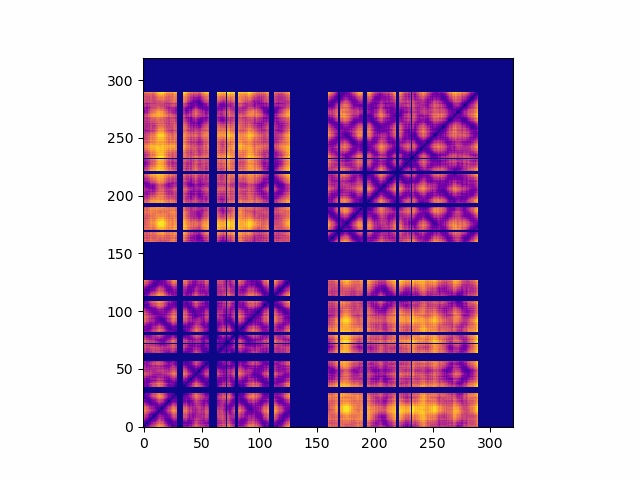
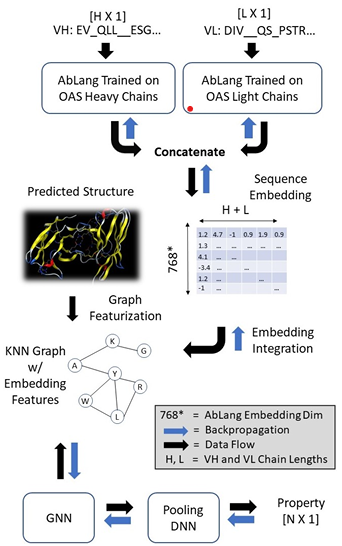

# AbLEF: Antibody Langauge Ensemble Fusion

fuses antibody structural ensemble and language representation for property prediction

current models include:
- language -- AbLang, ProtBERT, ProtBERT-BFD
- multi-structure ensemble -- LEF (CNN transformer)

```
@article{rollins2023,
        title = {{AbLEF}: {Antibody} {Language} {Ensemble} {Fusion} for {thermodynamically} {empowered} {property} {predictions}},
        journal = {The NeurIPS Workshop on New Frontiers of AI for Drug Discovery and Development (AI4D3 2023)},
        author = {Rollins, Zachary A and Widatalla, Talal and Waight, Andrew and Cheng, Alan C and Metwally, Essam},
	url = {https://ai4d3.github.io/papers/55.pdf},
        month = dec,
        year = {2023}}
```



## requirements
- git lfs (for locally stored language models)
    - protbert requires local installation to config: https://huggingface.co/Rostlab/protbert
    - protbert-bfd requires local installation to config: https://huggingface.co/Rostlab/protbert-bfd
    - ablang is locally installed with .yaml file
- aLEF.yaml

## preprocess data
### ensemble generation and structural clustering
- Boltzmann imitator for multi-structure ensemble generation saved as pdb files (LowModeMD, MD, metadynamics, replica-exchange, etc.)
- pdb files from ensemble generation can be clustered using density based spatial clustering on the backbone atom distance matrices
```
    cluster/main.py
```
### data storage
- each antibody is organized into a directory which must contain the pdb and fasta files
```
    data/train/
    data/holdout/
```
### data processing
- to utilize ensemble fusion (LEF) pdb files in data directories are converted to pairwise distance tensors and saved as numpy arrays
- by default the residue centroid, side-chain centroid, alpha-carbon, and beta-carbon are computed (roidDIST, scoidDIST, CaDIST, and CbDIST)
- fasta files are converted to txt files for the heavy and light chain using IMGT canonical alignment (padded as zeros)
- after processing clustered pdbs, the distance matrices will be stored in their respective directories depicted in the following gif
```
    data/preprocess.py
```



## AbPROP integration



```
@article{widatalla2023,
	title = {{AbPROP}: {Language} and {Graph} {Deep} {Learning} for {Antibody} {Property} {Prediction}},
	journal = {ICML Workshop on Computational Biology},
	author = {Widatalla, Talal and Rollins, Zachary A and Chen, Ming-Tang and Waight, Andrew and Cheng, Alan},
	url = {https://icml-compbio.github.io/2023/papers/WCBICML2023_paper53.pdf},
	month = jul,
	year = {2023}}
```

- we also integrated codebase from AbPROP to compare the AbLEF results with graph neural netowrks + language fusion
- graph neural networks are currently only single-structure molecular representations
- to utilize graph neural networks pdb files are converted and saved as torch geometric Data objects for GVP & GAT
```
    data/preprocess_graphs/graph_structs.py
```


## train and hyperparameter tune
- training and tuning execution is specified by the configuration files (config/setup.json)
```
    python ./src/train_tune.py
```

### hyperparameter tune
- setup["training"]["ray_tune"] == True
- specify hyperparameter search space in the '__main__' of ./src/train_tune.py
- ray cluster must be initialized before hyperparameter tuning execution
- submit PBS script with specified num_cpus and num_gpus
- start ray cluster
```
    ray start --head --num-cpus=8 --num-gpus=4 --temp-dir="/absolute/path/to/temporary/storage/"
    python ./src/train_tune.py
```

### inference and holdout
- test trained/validated models on holdout by specifying config/setup.json
- AbLEF models trained on hicrt and tagg are located in models/weights
- setup['holdout']['model_path']
- setup['holdout']['holdout_data_path]
```
    python ./src/holdout.py
```


### logging information and model storage
- train_tune.log files are recorded and saved for every time stamped batch run
- runs are also recorded on tensorboard
- ***** = unqiue file identifier (e.g., time stamp or number)
```
    logs/batch_*****/train_tune.log
    logs/batch_*****/events.out.tfevents.***** (setup["training"]["ray_tune"] == False)
    logs/batch_*****/ray_tune/hp_tune_*****/checkpoint_*****/events.out.tfevents.***** (setup["training"]["ray_tune"] == True)
```

- hyperparameter tune runs are implemented by ray tune and models are stored
- non-hyperparameter tuned models are also stored
```
    logs/batch_*****/ray_tune/hp_tune_*****/checkpoint_*****/dict_checkpoint.pkl (setup["training"]["ray_tune"] == True)
    models/weights/batch_*****/ALEF*****.pth (setup["training"]["ray_tune"] == False)
```

# License
    AbLEF fuses antibody language and structural ensemble representations for property prediction.
    Copyright © 2023 Merck & Co., Inc., Rahway, NJ, USA and its affiliates. All rights reserved.

    This program is free software: you can redistribute it and/or modify
    it under the terms of the GNU General Public License as published by
    the Free Software Foundation, either version 3 of the License, or
    (at your option) any later version.

    This program is distributed in the hope that it will be useful,
    but WITHOUT ANY WARRANTY; without even the implied warranty of
    MERCHANTABILITY or FITNESS FOR A PARTICULAR PURPOSE.  See the
    GNU General Public License for more details.

    You should have received a copy of the GNU General Public License
    along with this program.  If not, see <http://www.gnu.org/licenses/>.
